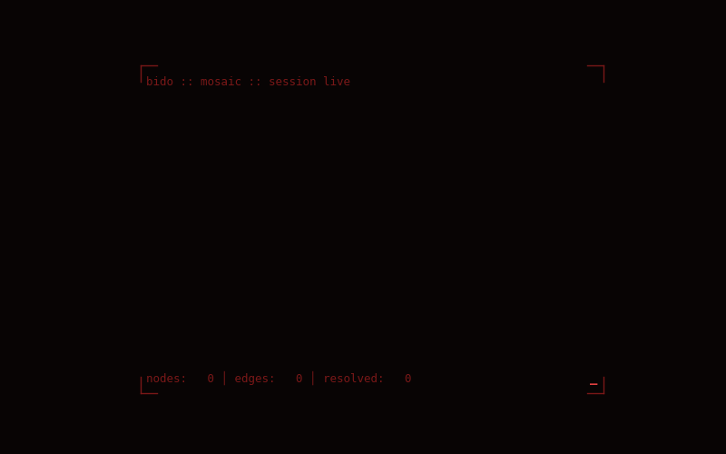

# bido
a sanctions-evasion detection engine. resolves entities across multilingual open sources into a graph structure, then surfaces coordination patterns via network analysis.

  

## architecture (so far)

- **mosaic (c++17)** — edges are built from co-occurrence and cross-source references. designed for high-throughput reads during analysis passes rather than low-latency single-entity lookups essentially the workload is graph algorithms over large subgraphs, not individual entity queries.
- **python + spacy microservices** — these handle multilingual named-entity extraction; recognizers are configured per-language rather than run universally, since precision drops fast on the wrong linguistic prior. 
- **cascade resolution** — entities pass through progressive resolution stages before being committed to the graph; false-positive suppression handled at boundary layers
  
## stack
`c++17` · `python` · `spacy`

## where is it? 

the source is not published right now. why? 
short answer is that ***its still in dev***. 
long answer is that the ***detection logic is the substance of the project***, and publishing the heuristics would be counterproductive to their purpose. 
